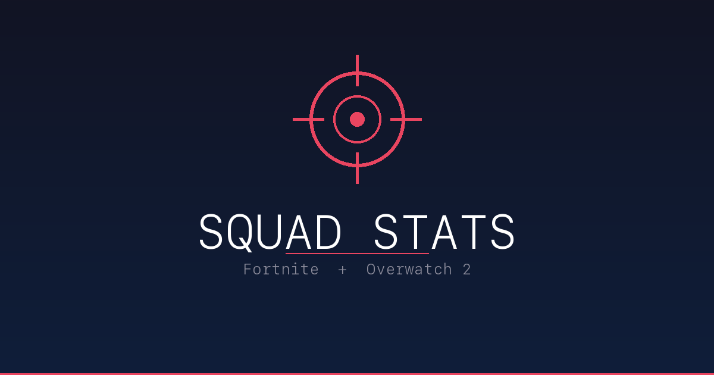

# Squad Tracker

Fortnite and Overwatch 2 stats dashboard for tracking your squad. Built with Streamlit.

**Live app:** [dubcards.streamlit.app](https://dubcards.streamlit.app)



## Features

### Fortnite
- Battle cards with K/D, win rate, kills, score, and more for each player
- Time window filters: Lifetime, Season, Today, Yesterday, Last 7 Days, Last 30 Days, Custom Range
- Squad comparison bar charts (K/D, win rate, kills/match, score/match)
- Skill radar chart normalized across squad
- K/D trend line - weekly segments over the past 12 weeks
- Mode breakdown table (Solo, Duo, Squad, LTM)
- Input breakdown (KB/Mouse, Gamepad, Touch)

### Overwatch 2
- Battle cards with KDA, win rate, eliminations, assists, damage, healing
- Competitive rank display with role icons
- Squad comparison charts (KDA, win rate, avg damage, avg healing)
- Skill radar chart
- Role breakdown table (Tank, Damage, Support)
- Per-hero stats table and top 5 heroes chart

### Data Definitions
Both tabs include expandable data definitions explaining every stat and its source.

## Data Sources

| Source | What it provides | Auth |
|--------|-----------------|------|
| [fortnite-api.com](https://fortnite-api.com) | Lifetime + season stats | Free API key |
| Epic Stats Proxy | Custom time windows (today, 7d, 30d, custom range) | Epic OAuth device auth |
| [OverFast API](https://overfast-api.tekrop.fr) | OW2 career stats, hero breakdowns, ranks | None (public) |

## Setup

### Quick start (Streamlit Cloud)

1. Fork this repo
2. Connect it to [Streamlit Cloud](https://share.streamlit.io)
3. Add secrets in your app's Settings > Secrets:

```toml
FORTNITE_API_KEY = "your-key-from-dash.fortnite-api.com"

[epic_device_auth]
account_id = "your-epic-account-id"
device_id = "your-device-id"
secret = "your-device-secret"
client_id = "3f69e56c7649492c8cc29f1af08a8a12"
client_secret = "b51ee9cb12234f50a69efa67ef53812e"
```

### Local development

```bash
pip install -r requirements.txt
```

Create `.streamlit/secrets.toml` with the same secrets above, then:

```bash
streamlit run app.py
```

### Epic OAuth setup (for 7/30 day and custom range stats)

The Fortnite public API only provides lifetime and season stats. For custom time windows, you need Epic OAuth with device auth:

```bash
python epic_auth.py
```

This opens your browser to log in to Epic Games, then creates permanent device auth credentials that auto-refresh. You only need to do this once.

## Daily Stats Snapshot (MotherDuck)

`snapshot.py` fetches daily stats for all players and stores them in MotherDuck (cloud DuckDB). This powers the K/D trend chart without hitting the Epic API on every page load.

```bash
# Create the table
python snapshot.py --setup

# Backfill last 12 weeks
python snapshot.py --backfill 84

# Fetch yesterday's stats (runs daily via GitHub Action)
python snapshot.py
```

Requires `MOTHERDUCK_TOKEN` in `.env` or as an environment variable.

A GitHub Action (`.github/workflows/daily_snapshot.yml`) runs this automatically at 3am EST.

## Project Structure

```
app.py              # Streamlit app
epic_auth.py        # Epic Games OAuth + stats proxy client
snapshot.py         # Daily stats snapshot writer (MotherDuck)
squad.json          # Player list (gitignored, defaults in app.py)
preview.png         # Social preview image
docs/index.html     # GitHub Pages redirect with OG meta tags
.github/workflows/  # Daily snapshot GitHub Action
```

## Tech Stack

- Python, Streamlit, Plotly
- Epic Games OAuth (device auth)
- MotherDuck (cloud DuckDB) for historical stats
- GitHub Actions for daily data collection
